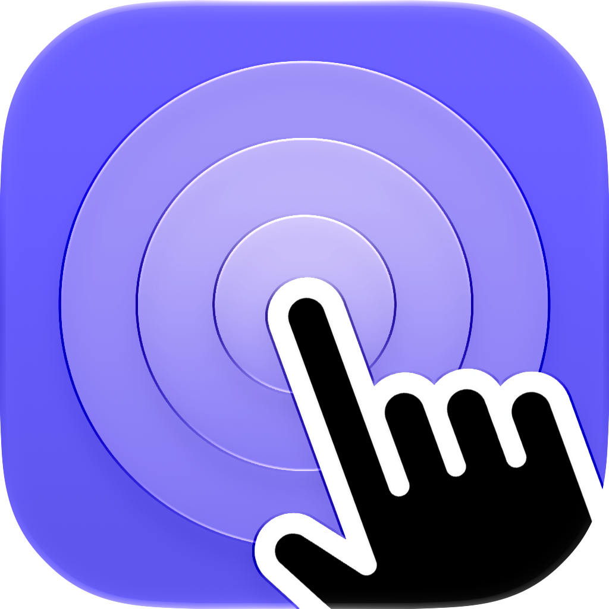
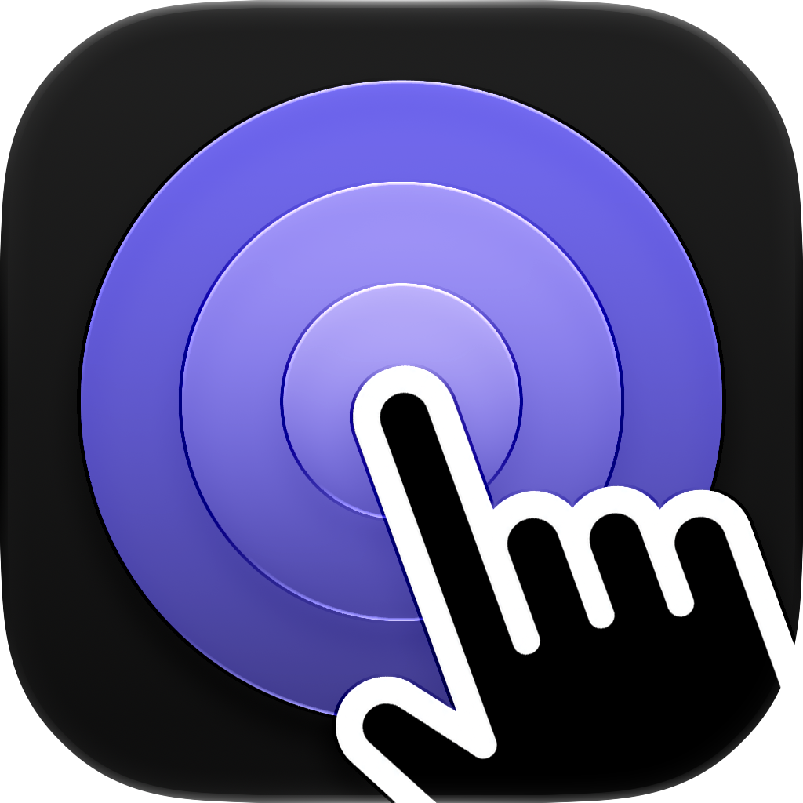

# Glidex

[English](README.md) | [简体中文](README.zh-CN.md)

| 默认 | 深色 |
|:---:|:---:|
|  |  |

Glidex 将 Mac 触控板转换为已启动的 iPhone Simulator 的多点触控输入。它是一个轻量级 macOS 菜单栏应用，支持 Navigate、锚定 Point/Edge 输入、一至五指 Direct Touch，以及手势录制和回放。

Glidex 同时支持旧版 Simulator 应用和 Xcode Device Hub。项目使用未公开的 Apple framework 和触控板 API，因此兼容性可能随 macOS 和 Xcode 版本变化。

## 功能

- 触控板导航、缩放、旋转、单击、长按和拖动
- 一至五个真实触点的 Direct Touch 映射
- 带可编辑固定锚点的 Point 和 Edge 模式
- Device Hub 与旧版 Simulator 窗口追踪
- 可选的 Simulator 可见性和指针范围限制
- 锚点和活动触点指示器
- 版本化 JSON 手势录制与确定性回放
- 菜单栏控制、诊断和轻量自动化 CLI

## 系统要求

- macOS 14 或更高版本
- Apple Silicon Mac
- 安装了 iOS Simulator runtime 的 Xcode
- 自动连接时需要一个可见且已启动的 iPhone Simulator
- Glidex 的辅助功能权限

当前实现主要在较新的 Xcode 和 Device Hub 版本上测试。不支持 Intel Mac 和实体 iOS 设备。

## 构建与运行

```bash
git clone https://github.com/jhao941/Glidex.git
cd Glidex
swift build
swift test
swift run glidex-capture
```

首次启动时，请在 **系统设置 > 隐私与安全性 > 辅助功能** 中允许 Glidex，然后在菜单栏选择 **Reconnect to Simulator**。

构建本地 app bundle 和 CLI：

```bash
./scripts/build-app.sh
open dist/Glidex.app
```

该脚本生成带 ad-hoc 签名的开发版应用，未经公证，不能替代公开分发所需的 Gatekeeper 流程。

生成可拖拽安装的磁盘映像：

```bash
./scripts/build-dmg.sh
```

生成的 `dist/Glidex-0.1.0.dmg` 包含 Glidex 和 Applications 快捷入口，其签名状态与内部 app bundle 相同。

## 输入模式

### Navigate

默认模式。触控板手势会移动一个虚拟触点；双指可用于导航、缩放和旋转。鼠标单击、长按和拖动会映射为普通单点触控输入。

原始手势开始时按住 Option，可将手势锚定在 Simulator 内当前指针位置。

### Direct Touch

将触控板表面映射到 Simulator 屏幕。一根真实手指对应一个 Simulator 触点，最多支持五个触点。使用 `Control-Option-D` 在 Direct Touch 与之前的模式之间切换。

### Point 与 Edge

Point 使用固定的虚拟手指位置。Edge 选择最近的屏幕边缘，并保留锚点沿该边缘的位置。解锁锚点后可以编辑，重新锁定后即可注入输入。

## 录制与回放

在菜单栏打开 **Automation**：

1. 选择 **Start Recording**。
2. 执行一个或多个手势。
3. 选择 **Stop and Save Recording**。
4. 使用 **Replay Last Recording** 或 **Replay Recording…**。

录制文件保存在：

```text
~/Library/Application Support/Glidex/Recordings/
```

坐标经过归一化，因此兼容的录制可以在不同 Simulator 尺寸上回放。回放期间会阻止实时输入，并在停止、中断或断开连接时可靠释放活动触点。

## CLI

CLI 有意保持轻量，仅开放实用的注入与回放操作，并不试图替代 idb 或成为通用设备自动化平台。

```bash
swift run glidex list
swift run glidex tap --x 120 --y 300
swift run glidex live-drag --from 120,700 --to 120,300 --duration 0.5
swift run glidex pinch --center 200,400 --scale 1.2 --duration 0.5
swift run glidex recordings list
swift run glidex recordings replay --file gesture.json --rate 1.0
```

当多个 Simulator 已启动时，回放命令应添加 `--udid DEVICE_UDID`。

## 架构

输入通过明确且可测试的边界流动：

```text
RawTouchStream -> GestureInterpreter -> AnchorPolicy
               -> TouchTransaction -> TouchSink -> Simulator HID
```

Replay 在手势识别之后的 `TouchSink` 层进入，因此能为所有输入模式保留录制时精确的触点生命周期。私有 ABI 加载隔离在 `GlidexCore` 中；AppKit 菜单和窗口代码位于 `GlidexCapture`。

更深入的实现说明请参阅 [输入验证](docs/v1-input-validation.md) 和 [菜单验证](docs/menu-bar-validation.md)。

## 已知限制

- Apple 私有 API 可能在 Xcode 或 macOS 更新后失效。
- 自动连接遇到多个候选 Simulator 窗口时会拒绝猜测。
- 部分 Simulator 或系统 UI 版本存在自身的手势问题。将行为归因于 Glidex 前，请在多个 iOS runtime 上验证。
- HID 发送成功日志不能证明目标 UI 已响应。
- 仓库尚未配置正式发布签名与公证。

## 隐私与安全

Glidex 不需要网络访问，也不会上传录制文件。导入的 JSON 会在回放前经过验证。报告方式与兼容性说明请参阅 [SECURITY.zh-CN.md](SECURITY.zh-CN.md)。

## 参与贡献

欢迎贡献。修改输入生命周期或私有 framework 代码前，请先阅读 [CONTRIBUTING.zh-CN.md](CONTRIBUTING.zh-CN.md)。

## 许可证

Glidex 使用 [MIT License](LICENSE)。

本项目独立于 Meta、Apple、idb 和 FBSimulatorControl，不依赖或捆绑这些库。项目中有一个精简的 Indigo wire-layout header 基于 MIT License 改编自 FBSimulatorControl，详情请参阅 [THIRD_PARTY_NOTICES.md](THIRD_PARTY_NOTICES.md)。
